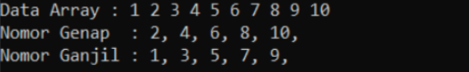
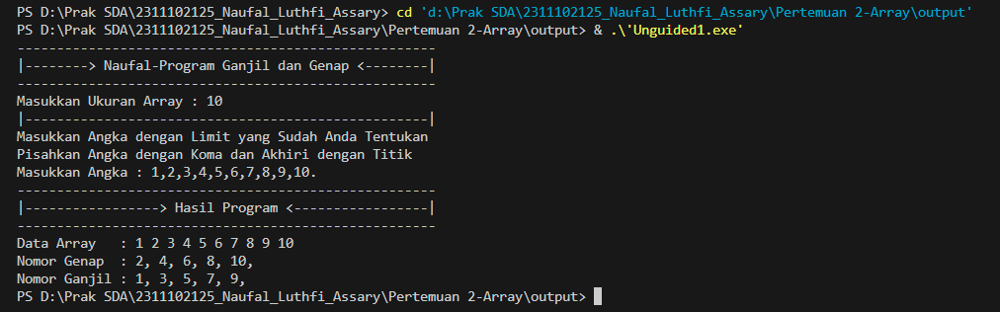
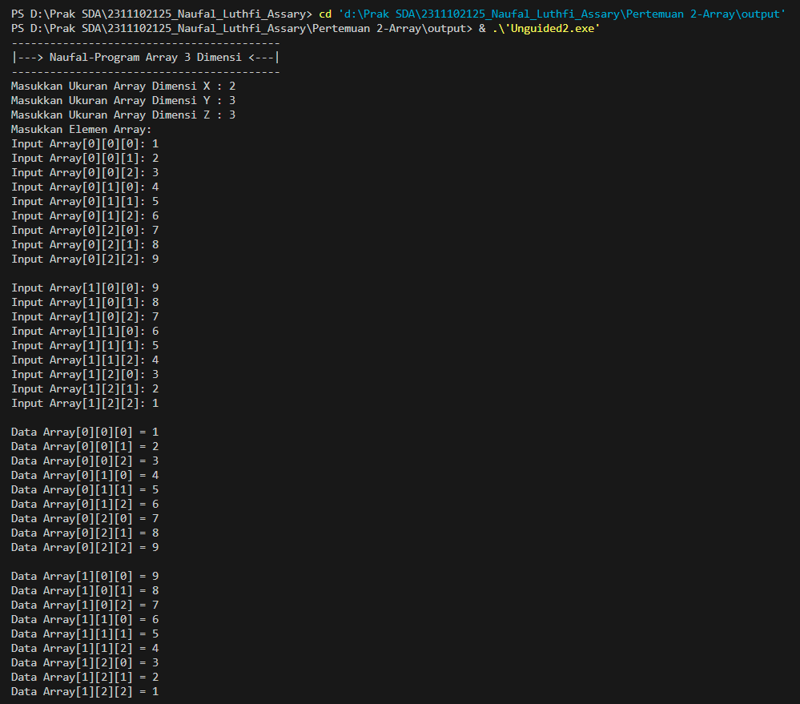
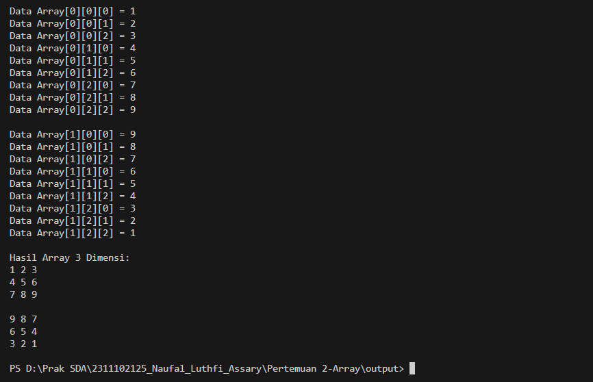
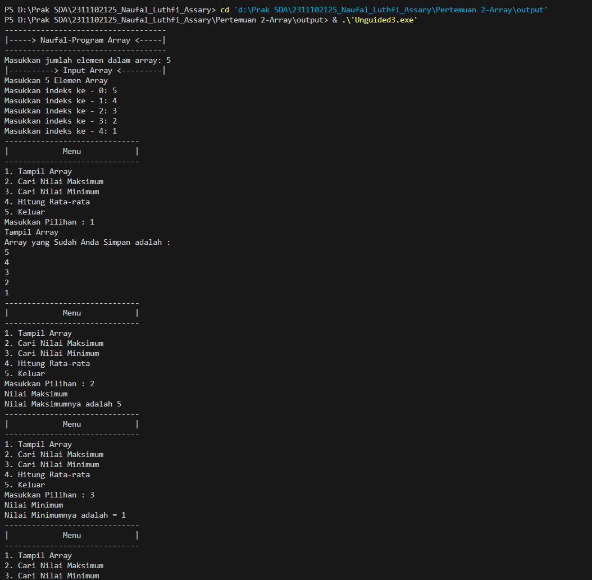
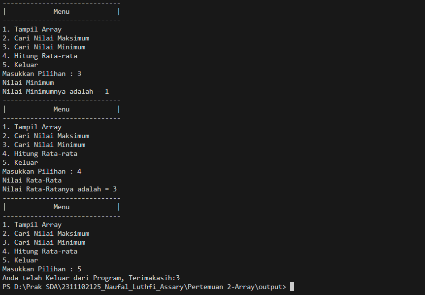

# <h1 align="center">Laporan Praktikum Modul Array</h1>
<p align="center">Naufal Luthfi Assary</p>
<p align="center">2311102125</p>

## Dasar Teori

Array adalah struktur data yang digunakan untuk menyimpan sekumpulan data dengan tipe data yang sama secara berurutan. Setiap data dalam array memiliki indeks, sehingga mudah diakses dan dimanipulasi.

1.  Array Satu Dimensi
Array satu dimensi adalah array dasar yang terdiri dari satu baris elemen. Setiap elemen memiliki indeks yang berurutan, dimulai dari 0 hingga (panjang array - 1). Array satu dimensi sering digunakan untuk menyimpan data yang sederhana dan linier. Contohnya adalah array yang menyimpan daftar nilai mahasiswa, daftar harga barang, atau deret bilangan.

2.  Array Dua Dimensi
Array dua dimensi, juga dikenal sebagai matriks, adalah perluasan dari array satu dimensi yang terdiri dari baris dan kolom. Setiap elemen dalam array dua dimensi memiliki dua indeks, yaitu indeks baris dan indeks kolom. Array dua dimensi sering digunakan untuk menyimpan data yang berstruktur seperti tabel atau matriks. Contohnya adalah array yang menyimpan nilai ujian beberapa siswa untuk beberapa mata pelajaran, atau array yang menyimpan data piksel dalam gambar.

3.  Array Multidimensi
Array multidimensi adalah array dengan lebih dari dua dimensi atau lebih. Array ini memiliki banyak dimensi sehingga elemen-elemennya dapat diakses menggunakan lebih dari dua indeks atau key. Array multidimensi digunakan untuk menyimpan data yang lebih kompleks, seperti data spasial, data temporal, atau data yang memiliki struktur hierarkis. Contohnya adalah array tiga dimensi yang menyimpan data warna RGB untuk beberapa objek dengan beberapa bagian dan beberapa warna, atau array yang menyimpan data sensor dalam waktu untuk beberapa lokasi.

## Guided 

### 1. Input Program Array Tiga Dimensi

```C++
#include <iostream>
using namespace std;
// PROGRAM INPUT ARRAY 3 DIMENSI
int main()
{
    // Deklarasi array
    int arr[2][3][3];
    // Input elemen
    for (int x = 0; x < 2; x++)
    {
        for (int y = 0; y < 3; y++)
        {
            for (int z = 0; z < 3; z++)
            {
                cout << "Input Array[" << x << "][" << y << "][" << z << "] = ";
                cin >> arr[x][y][z];
            }
        }
        cout << endl;
    }
    // Output Array
    for (int x = 0; x < 2; x++)
    {
        for (int y = 0; y < 3; y++)
        {
            for (int z = 0; z < 3; z++)
            {
                cout << "Data Array[" << x << "][" << y << "][" << z << "] = " << arr[x][y][z] << endl;
            }
        }
    }
    cout << endl;
    // Tampilan array
    for (int x = 0; x < 2; x++)
    {
        for (int y = 0; y < 3; y++)
        {
            for (int z = 0; z < 3; z++)
            {
                cout << arr[x][y][z] << ends;
            }
            cout << endl;
        }
        cout << endl;
    }
}

```
Program di atas adalah program untuk membuat array tiga dimensi dengan ukuran yang telah ditentukan (2x3x3) dan memungkinkan pengguna untuk memasukkan elemen-elemen array. Setelah pengguna memasukkan elemen, program menampilkan data array dalam format yang terstruktur dan juga dalam format yang lebih sederhana.

### 2. Program Mencari Nilai Maksimal pada Array

```C++
#include <iostream>
using namespace std;
int main()
{
    int maks, a, i = 1, lokasi;
    cout << "Masukkan panjang array: ";
    cin >> a;
    int array[a];
    cout << "Masukkan " << a << " angka\n";
    for (i = 0; i < a; i++)
    {
        cout << "Array ke-" << (i) << ": ";
        cin >> array[i];
    }
    maks = array[0];
    for (i = 0; i < a; i++)
    {
        if (array[i] > maks)
        {
            maks = array[i];
            lokasi = i;
        }
    }
    cout << "Nilai maksimum adalah " << maks << " berada di Array ke " << lokasi << endl;
}

```
Program di atas meminta pengguna untuk memasukkan panjang array, kemudian mengisi array dengan angka-angka yang dimasukkan oleh pengguna. Setelah array terisi, program mencari nilai maksimum di dalam array dan menampilkan nilai maksimum beserta indeksnya.

## Unguided 

### 1. Buatlah program untuk menampilkan Output seperti berikut dengan data yang diinputkan oleh user!
```C++
// Laprak 2 - Unguided 1
// Naufal Luthfi Assary - 2311102125
// IF-11-D
#include <iostream>

using namespace std;

int main() {
    int SizeArray_125; // Ukuran Array yang dimasukkan oleh User
    cout << "-----------------------------------------------------\n";
    cout << "|--------> Naufal-Program Ganjil dan Genap <--------|\n";
    cout << "-----------------------------------------------------\n";
    cout << "Masukkan Ukuran Array : "; 
    cin >> SizeArray_125;

    int Angka_125[SizeArray_125]; // Deklarasi Array untuk Menyimpan Angka-Angka
    int Genap_125[SizeArray_125]; // Deklarasi Array untuk Menyimpan Angka Genap
    int Ganjil_125[SizeArray_125]; // Deklarasi Array untuk Menyimpan Angka Ganjil
    int Genap = 0; // Jumlah Angka untuk Angka Genap
    int Ganjil = 0; // Jumlah Angka untuk Angka Ganjil

    cout << "|---------------------------------------------------|\n";

    // Meminta Pengguna untuk Memasukkan Angka-Angka
    cout << "Masukkan Angka dengan Limit yang Sudah Anda Tentukan\n";
    cout << "Pisahkan Angka dengan Koma dan Akhiri dengan Titik\n";
    cout << "Masukkan Angka : ";
    for (int i = 0; i < SizeArray_125; ++i) {
        cin >> Angka_125[i];
        char comma;
        cin >> comma;
        if (comma == '\n') // Memeriksa Input yang dipisahkan oleh Koma dan Mengakhiri dengan Titik
            break;
    }

    // Memisahkan angka genap dan ganjil
    for (int i = 0; i < SizeArray_125; ++i) {
        if (Angka_125[i] % 2 == 0)
            Genap_125[Genap++] = Angka_125[i]; // Menyimpan Angka Genap
        else
            Ganjil_125[Ganjil++] = Angka_125[i]; // Menyimpan Angka Ganjil
    }

    cout << "-----------------------------------------------------\n";
    cout << "|-----------------> Hasil Program <-----------------|\n";
    cout << "-----------------------------------------------------\n";

    // Menampilkan data array yang dimasukkan oleh pengguna
    cout << "Data Array   : ";
    for (int i = 0; i < SizeArray_125; ++i) {
        cout << Angka_125[i];
        if (i != SizeArray_125 - 1)
            cout << " ";
    }
    cout << endl;

    // Menampilkan angka genap
    cout << "Nomor Genap  : ";
    for (int i = 0; i < Genap; ++i) {
        cout << Genap_125[i];
        cout << ", ";
    }
    cout << endl;

    // Menampilkan angka ganjil
    cout << "Nomor Ganjil : ";
    for (int i = 0; i < Ganjil; ++i) {
        cout << Ganjil_125[i];
        cout << ", ";
    }
    cout << endl;

    return 0;
}

```
#### Output:


Deskripsi :

Program diatas ialah program yang menggunakan Array yang digunakan memasukkan ukuran array, lalu meminta pengguna untuk memasukkan angka-angka sesuai dengan ukuran array yang dimasukkan. Setelah itu, program akan memisahkan angka-angka genap dan ganjil dari array yang dimasukkan oleh pengguna, dan menampilkannya secara terpisah. Program ini menghasilkan output yang mencakup data array yang dimasukkan, angka-angka genap, dan angka-angka ganjil dalam format yang sesuai.

### 2. Buatlah program Input array tiga dimensi (seperti pada guided) tetapi jumlah atau ukuran elemennya diinputkan oleh user!


```C++
// Laprak 2 - Unguided 2
// Naufal Luthfi Assary - 2311102125
// IF-11-D
#include <iostream>

using namespace std;

int main() {
    int X_125, Y_125, Z_125; // Deklarasi Variabel Untuk Ukuran Array 3 Dimensi

    // Meminta Input Ukuran Array untuk Setiap Dimensi
    cout << "------------------------------------------\n";
    cout << "|---> Naufal-Program Array 3 Dimensi <---|\n";
    cout << "------------------------------------------\n";
    cout << "Masukkan Ukuran Array Dimensi X : "; cin >> X_125;
    cout << "Masukkan Ukuran Array Dimensi Y : "; cin >> Y_125;
    cout << "Masukkan Ukuran Array Dimensi Z : "; cin >> Z_125;

    // Deklarasi Array 3 Dimensi dengan Ukuran yang dimasukkan Oleh User
    int Arr_125[X_125][Y_125][Z_125];

    // Meminta User Untuk Memasukkan Elemen Array
    cout << "Masukkan Elemen Array:" << endl;
    for (int x = 0; x < X_125; x++) {
        for (int y = 0; y < Y_125; y++) {
            for (int z = 0; z < Z_125; z++) {
                cout << "Input Array[" << x << "][" << y << "][" << z << "]: ";
                cin >> Arr_125[x][y][z];
            }
        }
        cout << endl;
    }

    // Menampilkan Sebagian Data Array 3 Dimensi
    for (int x = 0; x < X_125; x++) {
        for (int y = 0; y < Y_125; y++) {
            for (int z = 0; z < Z_125; z++) {
                cout << "Data Array[" << x << "][" << y << "][" << z << "] = " << Arr_125[x][y][z] << endl;
            }
        }
        cout << endl;
    }

    // Menampilkan Seluruh Data Array 3 Dimensi
    cout << "Hasil Array 3 Dimensi:" << endl;
    for (int x = 0; x < X_125; x++) {
        for (int y = 0; y < Y_125; y++) {
            for (int z = 0; z < Z_125; z++) {
                cout << Arr_125[x][y][z] << " ";
            }
            cout << endl;
        }
        cout << endl;
    }

    return 0;
}

```
#### Output:



Deskripsi :

Program di atas adalah program yang memungkinkan pengguna untuk membuat array tiga dimensi dengan ukuran yang ditentukan oleh pengguna. Pengguna diminta untuk memasukkan ukuran setiap dimensi dan elemen-elemen array. Setelah itu, program menampilkan sebagian data array dan seluruh data array tiga dimensi yang dimasukkan oleh pengguna.

### 3. Buatlah program menu untuk mencari nilai Maksimum, Minimum dan Nilai rata – rata dari suatu array dengan input yang dimasukan oleh user!

```C++
// Laprak 2 - Unguided 3
// Naufal Luthfi Assary - 2311102125
// IF-11-D
#include <iostream> 

using namespace std; 

int main() {
    int Jml_Arr_125; // Deklarasi variabel untuk menyimpan jumlah elemen dalam array.
    cout << "------------------------------------\n";
    cout << "|-----> Naufal-Program Array <-----|\n"; 
    cout << "------------------------------------\n";
    cout << "Masukkan jumlah elemen dalam array: ";
    cin >> Jml_Arr_125; // Meminta pengguna untuk memasukkan jumlah elemen dalam array.

    int *Daftar_Arr_125 = new int[Jml_Arr_125]; // Mengalokasikan memori dinamis untuk array dengan ukuran yang dimasukkan oleh pengguna.
    int i, NilaiMin_125, NilaiMax_125; // Deklarasi variabel untuk perulangan dan menyimpan nilai minimum dan maksimum.
    float Rata_125; // Deklarasi variabel untuk menyimpan nilai rata-rata.

    // Meminta pengguna untuk memasukkan elemen-elemen array.
    cout << "|----------> Input Array <---------|" << endl;
    cout << "Masukkan " << Jml_Arr_125 << " Elemen Array " << endl;
    for (int i = 0; i < Jml_Arr_125; i++) {
        cout << "Masukkan indeks ke - " << i << ": ";
        cin >> Daftar_Arr_125[i];
    }

    while (true) { // Looping menu utama program.
        cout << "------------------------------" << endl;
        cout << "|            Menu            |" << endl; // Menampilkan menu pilihan.
        cout << "------------------------------" << endl;
        cout << "1. Tampil Array" << endl;
        cout << "2. Cari Nilai Maksimum" << endl;
        cout << "3. Cari Nilai Minimum" << endl;
        cout << "4. Hitung Rata-rata" << endl;
        cout << "5. Keluar" << endl;
        int pil_125;
        cout << "Masukkan Pilihan : ";
        cin >> pil_125; // Meminta pengguna memilih opsi.

        switch (pil_125) { // Memilih opsi berdasarkan pilihan pengguna.
            case 1:
                cout << "Tampil Array" << endl;
                cout << "Array yang Sudah Anda Simpan adalah : " << endl;
                for (i = 0; i < Jml_Arr_125; i++) {
                    cout << Daftar_Arr_125[i] << endl; // Menampilkan elemen-elemen array.
                }
                break;
            case 2:
                cout << "Nilai Maksimum" << endl;
                NilaiMax_125 = 0;
                for (i = 0; i < Jml_Arr_125; i++) {
                    if (Daftar_Arr_125[i] > NilaiMax_125) {
                        NilaiMax_125 = Daftar_Arr_125[i]; // Mencari nilai maksimum dalam array.
                    }
                }
                cout << "Nilai Maksimumnya adalah " << NilaiMax_125 << endl; // Menampilkan nilai maksimum.
                break;
            case 3:
                cout << "Nilai Minimum" << endl;
                NilaiMin_125 = Daftar_Arr_125[0];
                for (i = 0; i < Jml_Arr_125; i++) {
                    if (Daftar_Arr_125[i] < NilaiMin_125) {
                        NilaiMin_125 = Daftar_Arr_125[i]; // Mencari nilai minimum dalam array.
                    }
                }
                cout << "Nilai Minimumnya adalah = " << NilaiMin_125 << endl; // Menampilkan nilai minimum.
                break;
            case 4:
                cout << "Nilai Rata-Rata" << endl;
                Rata_125 = 0;
                for (i = 0; i < Jml_Arr_125; i++) {
                    Rata_125 += Daftar_Arr_125[i]; // Menghitung total nilai dalam array.
                }
                cout << "Nilai Rata-Ratanya adalah = " << Rata_125 / Jml_Arr_125 << endl; // Menampilkan nilai rata-rata.
                break;
            case 5:
                cout << "Anda telah Keluar dari Program, Terimakasih:3" << endl;
                return false; // Mengakhiri program.
            default:
                cout << "Pilihan tidak valid" << endl; // Menampilkan pesan jika pilihan tidak valid.
                break;
        }
    }

    return 0;
}

```
#### Output:



Deskripsi :

Program di atas adalah program sederhana yang memungkinkan pengguna untuk memasukkan elemen-elemen ke dalam array, dan kemudian melakukan operasi seperti menampilkan array, mencari nilai maksimum, mencari nilai minimum, menghitung nilai rata-rata, dan keluar dari program. Program ini menggunakan konsep alokasi memori dinamis untuk menangani array dengan ukuran yang ditentukan oleh pengguna.


## Kesimpulan
Array merupakan struktur data yang digunakan untuk menyimpan sekumpulan data dengan tipe data yang sama secara berurutan. Terdapat tiga jenis array yang umum digunakan: array satu dimensi, array dua dimensi (matriks), dan array multidimensi. Array satu dimensi digunakan untuk menyimpan data linier seperti daftar nilai atau harga barang. Array dua dimensi digunakan untuk data yang berstruktur seperti tabel atau matriks, misalnya untuk menyimpan nilai ujian siswa. Sedangkan array multidimensi digunakan untuk data yang lebih kompleks seperti data spasial atau temporal, misalnya menyimpan data warna RGB untuk objek dengan beberapa bagian dan beberapa warna. Dengan array, data dapat diakses dan dimanipulasi dengan mudah melalui indeks yang sesuai.


## Referensi
[1] Meidyan Permata Putri, Guntoro Barovih, Rezania Agramanisti Azdy, dkk. Algoritma Dan Struktur Data. Bandung, Jawa Barat. 2022.

[2] Wanra Tarigan. Algoritma Pemrograman Dan Struktur Data. Purbalingga, Jawa Tengah. 2022.