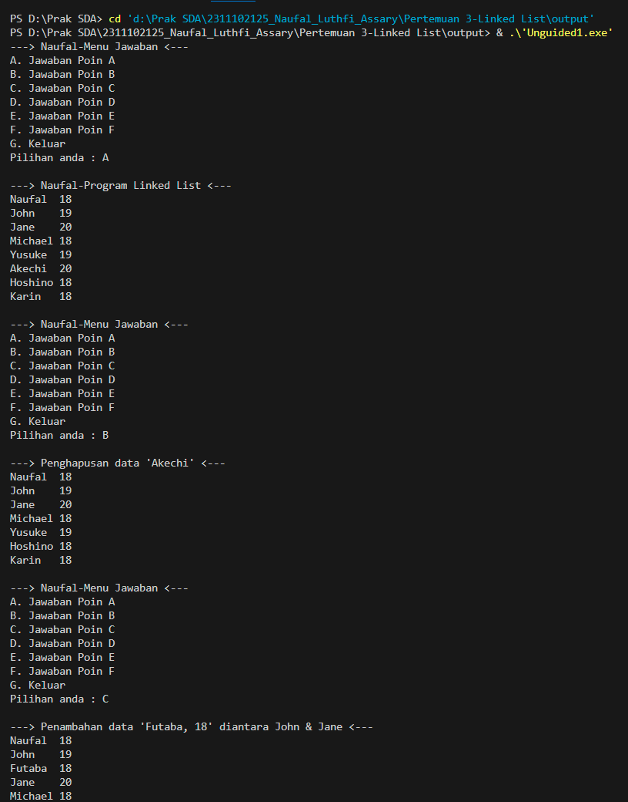
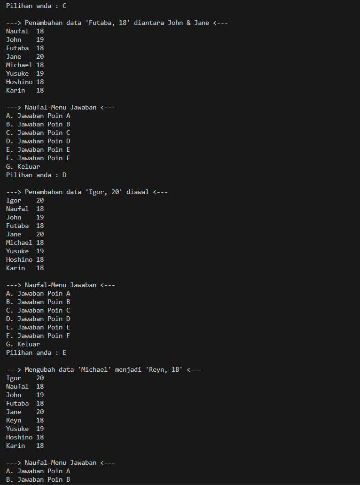
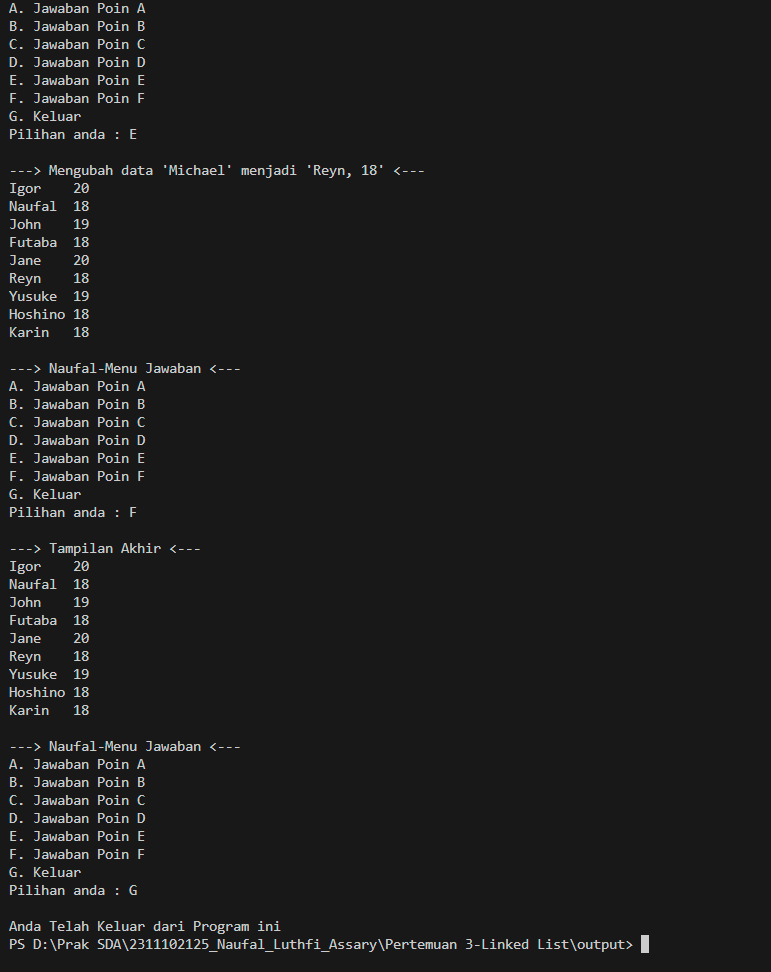
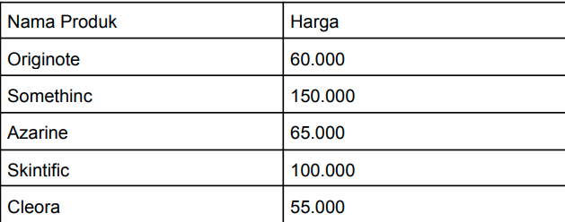
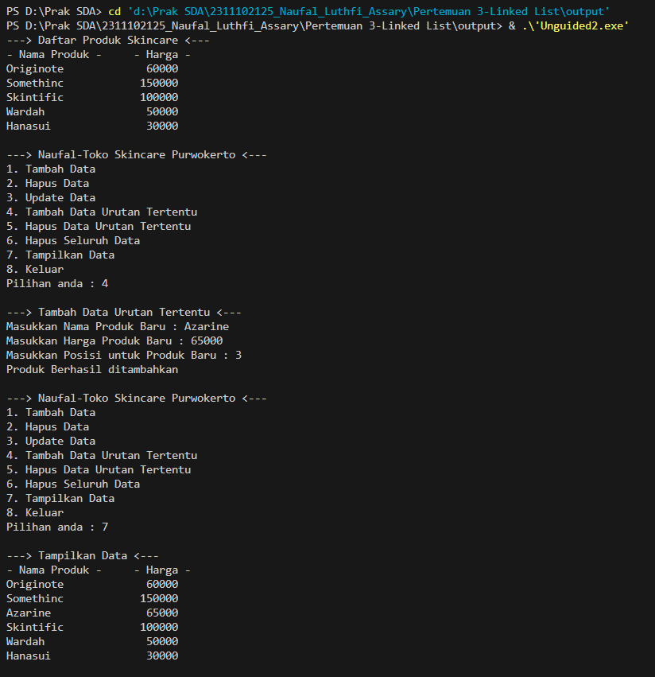
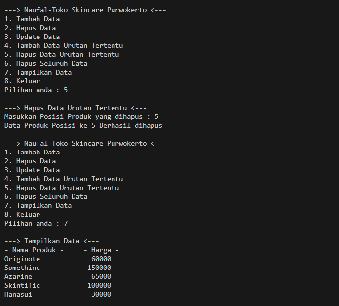
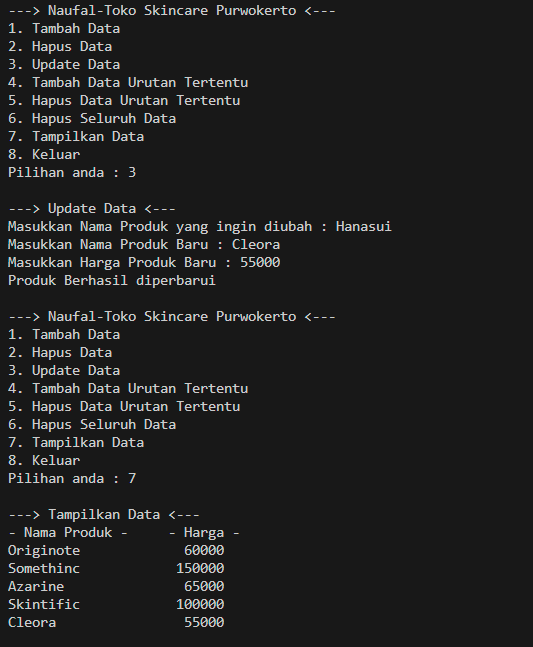
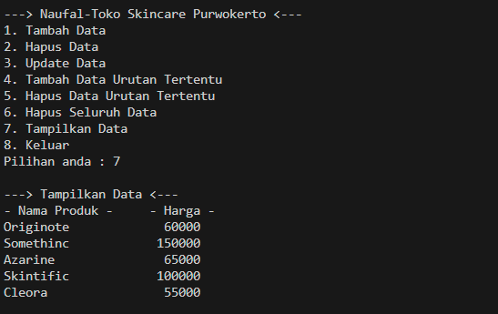

# <h1 align="center">Laporan Praktikum Modul Linked List</h1>
<p align="center">Naufal Luthfi Assary</p>
<p align="center">2311102125</p>

## Dasar Teori

Linked list adalah struktur data linier yang terdiri dari simpul-simpul yang saling terhubung. Setiap simpul menyimpan dua item: nilai data dan pointer yang menunjuk ke simpul berikutnya. Ada dua jenis linked list yang umum digunakan: Single Linked List dan Double Linked List.

Single Linked List terbagi menjadi dua macam, yaitu non-circular dan circular. Pada Single Linked List non-circular, pointer pada simpul terakhir menunjuk ke NULL, menandakan akhir dari list. Sedangkan pada Single Linked List circular, pointer pada simpul terakhir kembali menunjuk ke simpul pertama, membentuk lingkaran tertutup.

Double Linked List memiliki dua pointer dalam setiap simpul: satu untuk menunjuk ke simpul berikutnya (next) dan satu lagi untuk menunjuk ke simpul sebelumnya (prev). Keuntungan utama dari Double Linked List adalah kemampuannya untuk melakukan operasi penambahan dan penghapusan pada simpul mana saja dengan efisien, serta kemampuannya untuk melakukan traversal baik dari depan (head) maupun dari belakang (tail) list.

## Guided 

### 1. Latihan Single Linked List

```C++
// Laprak 3 - Guided 1
// Naufal Luthfi Assary - 2311102125
// IF-11-D

#include <iostream>
using namespace std;

///PROGRAM SINGLE LINKED LIST NON-CIRCULAR
//Deklarasi Struct Node
struct Node {
    int data;
    Node* next;
};

Node* head;
Node* tail;

//Inisialisasi Node
void init() {
    head = NULL;
    tail = NULL;
}

// Pengecekan
bool isEmpty() {
    if (head == NULL)
        return true;
    else
        return false;
}

//Tambah Depan
void insertDepan(int nilai) {
    //Buat Node baru
    Node* baru = new Node;
    baru->data = nilai;
    baru->next = NULL;

    if (isEmpty() == true) {
        head = tail = baru;
        tail->next = NULL;
    }
    else {
        baru->next = head;
        head = baru;
    }
}

//Tambah Belakang
void insertBelakang(int nilai) {
    //Buat Node baru
    Node* baru = new Node;
    baru->data = nilai;
    baru->next = NULL;

    if (isEmpty() == true) {
        head = tail = baru;
        tail->next = NULL;
    }
    else {
        tail->next = baru;
        tail = baru;
    }
}

//Hitung Jumlah List
int hitungList() {
    Node* hitung;
    hitung = head;
    int jumlah = 0;

    while (hitung != NULL) {
        jumlah++;
        hitung = hitung->next;
    }

    return jumlah;
}

//Tambah Tengah
void insertTengah(int data, int posisi) {
    if (posisi < 1 || posisi > hitungList()) {
        cout << "Posisi diluar jangkauan" << endl;
    }
    else if (posisi == 1) {
        cout << "Posisi bukan posisi tengah" << endl;
    }
    else {
        Node* baru, * bantu;
        baru = new Node();
        baru->data = data;

        // tranversing
        bantu = head;
        int nomor = 1;

        while (nomor < posisi - 1) {
            bantu = bantu->next;
            nomor++;
        }

        baru->next = bantu->next;
        bantu->next = baru;
    }
}

//Hapus Depan
void hapusDepan() {
    Node* hapus;

    if (isEmpty() == false) {
        if (head->next != NULL) {
            hapus = head;
            head = head->next;
            delete hapus;
        }
        else {
            head = tail = NULL;
        }
    }
    else {
        cout << "List kosong!" << endl;
    }
}

//Hapus Belakang
void hapusBelakang() {
    Node* hapus;
    Node* bantu;

    if (isEmpty() == false) {
        if (head != tail) {
            hapus = tail;
            bantu = head;

            while (bantu->next != tail) {
                bantu = bantu->next;
            }

            tail = bantu;
            tail->next = NULL;
            delete hapus;
        }
        else {
            head = tail = NULL;
        }
    }
    else {
        cout << "List kosong!" << endl;
    }
}

//Hapus Tengah
void hapusTengah(int posisi) {
    Node* hapus, * bantu, * bantu2;

    if (posisi < 1 || posisi > hitungList()) {
        cout << "Posisi di luar jangkauan" << endl;
    }
    else if (posisi == 1) {
        cout << "Posisi bukan posisi tengah" << endl;
    }
    else {
        int nomor = 1;
        bantu = head;

        while (nomor <= posisi) {
            if (nomor == posisi - 1) {
                bantu2 = bantu;
            }

            if (nomor == posisi) {
                hapus = bantu;
            }

            bantu = bantu->next;
            nomor++;
        }

        bantu2->next = bantu;
        delete hapus;
    }
}

//Ubah Depan
void ubahDepan(int data) {
    if (isEmpty() == false) {
        head->data = data;
    }
    else {
        cout << "List masih kosong!" << endl;
    }
}

//Ubah Tengah
void ubahTengah(int data, int posisi) {
    Node* bantu;

    if (isEmpty() == false) {
        if (posisi < 1 || posisi > hitungList()) {
            cout << "Posisi di luar jangkauan" << endl;
        }
        else if (posisi == 1) {
            cout << "Posisi bukan posisi tengah" << endl;
        }
        else {
            bantu = head;
            int nomor = 1;

            while (nomor < posisi) {
                bantu = bantu->next;
                nomor++;
            }

            bantu->data = data;
        }
    }
    else {
        cout << "List masih kosong!" << endl;
    }
}

//Ubah Belakang
void ubahBelakang(int data) {
    if (isEmpty() == false) {
        tail->data = data;
    }
    else {
        cout << "List masih kosong!" << endl;
    }
}

//Hapus List
void clearList() {
    Node* bantu, * hapus;
    bantu = head;

    while (bantu != NULL) {
        hapus = bantu;
        bantu = bantu->next;
        delete hapus;
    }

    head = tail = NULL;
    cout << "List berhasil terhapus!" << endl;
}

//Tampilkan List
void tampil() {
    Node* bantu;
    bantu = head;

    if (isEmpty() == false) {
        while (bantu != NULL) {
            cout << bantu->data << ends;
            bantu = bantu->next;
        }

        cout << endl;
    }
    else {
        cout << "List masih kosong!" << endl;
    }
}

int main() {
    init();
    insertDepan(3);
    tampil();
    insertBelakang(5);
    tampil();
    insertDepan(2);
    tampil();
    insertDepan(1);
    tampil();
    hapusDepan();
    tampil();
    hapusBelakang();
    tampil();
    insertTengah(7, 2);
    tampil();
    hapusTengah(2);
    tampil();
    ubahDepan(1);
    tampil();
    ubahBelakang(8);
    tampil();
    ubahTengah(11, 2);
    tampil();

    return 0;
}

```
Program di atas adalah implementasi dari sebuah single linked list non-circular. Program ini memiliki fungsi-fungsi dasar seperti inisialisasi, pengecekan apakah list kosong, penambahan elemen di depan, di belakang, di tengah, penghapusan elemen di depan, di belakang, di tengah, pengubahan nilai elemen di depan, di belakang, di tengah, penghitungan jumlah elemen dalam list, penghapusan semua elemen dalam list, dan menampilkan seluruh elemen dalam list. Setiap elemen dalam list direpresentasikan sebagai sebuah node yang berisi data integer dan pointer ke node berikutnya.

### 2. Program Mencari Nilai Maksimal pada Array

```C++
// Laprak 3 - Guided 2
// Naufal Luthfi Assary - 2311102125
// IF-11-D

#include <iostream>
using namespace std;

class Node {
public:
    int data;
    Node* prev;
    Node* next;
};

class DoublyLinkedList {
public:
    Node* head;
    Node* tail;

    DoublyLinkedList() {
        head = nullptr;
        tail = nullptr;
    }

    void push(int data) {
        Node* newNode = new Node;
        newNode->data = data;
        newNode->prev = nullptr;
        newNode->next = head;

        if (head != nullptr) {
            head->prev = newNode;
        }
        else {
            tail = newNode;
        }

        head = newNode;
    }

    void pop() {
        if (head == nullptr) {
            return;
        }

        Node* temp = head;
        head = head->next;

        if (head != nullptr) {
            head->prev = nullptr;
        }
        else {
            tail = nullptr;
        }

        delete temp;
    }

    bool update(int oldData, int newData) {
        Node* current = head;

        while (current != nullptr) {
            if (current->data == oldData) {
                current->data = newData;
                return true;
            }
            current = current->next;
        }

        return false;
    }

    void deleteAll() {
        Node* current = head;

        while (current != nullptr) {
            Node* temp = current;
            current = current->next;
            delete temp;
        }

        head = nullptr;
        tail = nullptr;
    }

    void display() {
        Node* current = head;

        while (current != nullptr) {
            cout << current->data << " ";
            current = current->next;
        }

        cout << endl;
    }
};

int main() {
    DoublyLinkedList list;

    while (true) {
        cout << "1. Add data" << endl;
        cout << "2. Delete data" << endl;
        cout << "3. Update data" << endl;
        cout << "4. Clear data" << endl;
        cout << "5. Display data" << endl;
        cout << "6. Exit" << endl;

        int choice;
        cout << "Enter your choice: ";
        cin >> choice;

        switch (choice) {
            case 1: {
                int data;
                cout << "Enter data to add: ";
                cin >> data;
                list.push(data);
                break;
            }
            case 2: {
                list.pop();
                break;
            }
            case 3: {
                int oldData, newData;
                cout << "Enter old data: ";
                cin >> oldData;
                cout << "Enter new data: ";
                cin >> newData;

                bool updated = list.update(oldData, newData);

                if (!updated) {
                    cout << "Data not found" << endl;
                }
                break;
            }
            case 4: {
                list.deleteAll();
                break;
            }
            case 5: {
                list.display();
                break;
            }
            case 6: {
                return 0;
            }
            default: {
                cout << "Invalid choice" << endl;
                break;
            }
        }
    }

    return 0;
}

```
Program di atas adalah implementasi dari sebuah Doubly Linked List. Program ini menyediakan berbagai opsi untuk memanipulasi data dalam struktur data tersebut, termasuk menambahkan data ke awal (push), menghapus data dari awal (pop), memperbarui data, menghapus semua data (clear), dan menampilkan data. Program ini berjalan dalam sebuah loop tak terbatas yang berhenti hanya jika pengguna memilih opsi keluar.

## Unguided 

### 1.  Buatlah program menu Single Linked List Non-Circular untuk menyimpan Nama dan Usia mahasiswa, dengan menggunakan inputan dari user. Lakukan operasi berikut:
ㅤa. Masukkan data sesuai urutan berikut. (Gunakan insert depan, belakang atau tengah). Data pertama yang dimasukkan adalah nama dan usia anda.
ㅤb. Hapus data Akechi
ㅤc. Tambahkan data berikut diantara John dan Jane: "Futaba 18"
ㅤd. Tambahkan data berikut di awal: "Igor 20"
ㅤe. Ubah data Michael menjadi: "Reyn 18"
ㅤf. Tampilkan seluruh data

```C++
// Laprak 3 - Unguided 1
// Naufal Luthfi Assary - 2311102125
// IF-11-D

#include<iostream>

using namespace std;

struct node{ 
    string Nama_125;
    int Umur_125;
    node *next;
};
    node *head; 
    node *tail; 


void Inisialisasi_125(){ // Inisialisasi list menjadi kosong dengan mengatur head dan tail menjadi NULL
    
    head = NULL;
    tail = NULL;
}

bool Kosong_125(){ // Fungsi untuk memeriksa apakah list kosong atau tidak
    if(head == NULL){
        return true; // Jika head NULL, maka list kosong
    } 
    else {
        return false; // Jika tidak, maka list tidak kosong
    }
}

void TambahDepan_125(string Name_125, int Age_125){ // Menambahkan node baru di depan list
    node *baru = new node; // Membuat node baru
    baru->Nama_125 = Name_125; // Mengisi data nama pada node baru
    baru->Umur_125 = Age_125; // Mengisi data umur pada node baru
    baru->next = NULL; 
    
    if(Kosong_125() == true){ // Jika list kosong
        head = tail = baru; // Node baru menjadi satu-satunya node dalam list
        tail->next = NULL; 
    } else {
        baru->next = head; // Node baru menunjuk ke node yang saat ini menjadi head
        head = baru; // Node baru menjadi head baru
    }
}

void TambahBelakang_125(string Name_125, int Age_125){ // Menambahkan node baru di belakang list
    node *baru = new node; // Membuat node baru
    baru->Nama_125 = Name_125; // Mengisi data nama pada node baru
    baru->Umur_125 = Age_125; // Mengisi data umur pada node baru
    baru->next = NULL; 
    
    if(Kosong_125() == true){ // Jika list kosong
        head = tail = baru; // Node baru menjadi satu-satunya node dalam list
        tail->next = NULL; 
    } else {
        tail->next = baru; // Node tail menunjuk ke node baru
        tail = baru; // Node baru menjadi tail baru
    }
}

int HitungNode_125(){ // Menghitung jumlah node dalam list
    node *hitung; 
    hitung = head; 
    int jumlah = 0;

    while(hitung != NULL){ // Selama belum mencapai akhir list
        jumlah++; // Menambah jumlah node
        hitung = hitung->next; // Beralih ke node selanjutnya
    }
    return jumlah; // Mengembalikan jumlah node
}

void TambahTengah_125(string Name_125, int Age_125, int Posisi_125){
    if(Posisi_125 < 1 || Posisi_125 > HitungNode_125()){ 
        cout << "Posisi node yang ditambahkan diluar jangkauan\n";
    } else if(Posisi_125 == 1){ 
        cout << "Posisi node yang akan ditambahkan bukan di tengah\n";
    } else {
       
        node *baru, *bantu;
        baru = new node; // Membuat node baru
        baru->Nama_125 = Name_125; // Mengisi data nama pada node baru
        baru->Umur_125 = Age_125; // Mengisi data umur pada node baru
        baru->next = NULL; 

        bantu = head; 
        int Nomor_125 = 1; 
        
        while(Nomor_125 < Posisi_125 - 1){ // Mencari posisi sebelum posisi yang ditentukan
            bantu = bantu->next; // Beralih ke node selanjutnya
            Nomor_125++; // Menambah nomor posisi
        }
        
        baru->next = bantu->next; 
        bantu->next = baru;  
    }
}


void HapusDepan_125(){ // Menghapus node pertama dalam list
    node* hapus; 

    if(Kosong_125() == false){ 
        if(head->next != NULL){ 
            hapus = head; 
            head = head->next; 
            delete hapus; 
        } 
        else { 
            head = tail = NULL; 
        }
    } 
    else { 
        cout << "List ini kosong!\n"; 
    }
}

void HapusBelakang_125(){ // Menghapus node terakhir dalam list
    node* hapus; 
    node* bantu; 
    if (Kosong_125() == false){ 
        if(head != tail){ 
            hapus = tail; 
            bantu = tail; 
            bantu = head; 

            while(bantu->next != tail){ 
                bantu = bantu->next; 
            }

            tail = bantu; 
            tail->next = NULL; 
            delete hapus;
        } 
        else {
            head = tail = NULL;
        }
    } 
    else {
        cout << "List ini kosong!\n";
    }
}

void HapusTengah_125(int Posisi_125){ // Menghapus node pada posisi tengah list
    node* hapus, * bantu, * bantu2;

    if(Posisi_125 < 1 || Posisi_125 > HitungNode_125()){ 
        cout << "Posisi node yang dihapus diluar jangkauan\n";
    } 
    else if(Posisi_125 == 1){
        cout << "Node yang dihapus bukan node tengah\n";
    } 
    else {
        int Nomor_125 = 1;
        bantu = head;
        
        while(Nomor_125 <= Posisi_125){
            if(Nomor_125 == Posisi_125 - 1){
                bantu2 = bantu;
            } 
            else if(Nomor_125 == Posisi_125){
                hapus = bantu;
            }
            bantu = bantu->next;
            Nomor_125++; 
        }
        bantu2->next = bantu;
        delete hapus;
    }
}

void UbahDepan_125(string Name_125, int Age_125){ // Mengubah data pada node pertama dalam list
    if(Kosong_125() == false){
        head->Nama_125 = Name_125;
        head->Umur_125 = Age_125;
    } 
    else {
        cout << "List ini kosong!\n";
    }
}

void UbahBelakang_125(string Name_125, int Age_125){ // Mengubah data pada node terakhir dalam list
    if(Kosong_125() == false){
        tail->Nama_125 = Name_125;
        tail->Umur_125 = Age_125;
    } 
    else {
        cout << "List ini kosong!\n";
    }
}

void UbahTengah_125(string Name_125, int Age_125, int Posisi_125){ // Mengubah data pada node di posisi tengah list
    node* bantu;

    if(Kosong_125() == false){
        if(Posisi_125 < 1 || Posisi_125 > HitungNode_125()){
            cout << "Node yang diubah diluar jangkauan\n";
        } 
        else if(Posisi_125 == 1){
            cout << "Node yang diubah bukan head\n";
        } 
        else {
            bantu = head;
            int Nomor_125 = 1;

            while(Nomor_125 < Posisi_125){
                Nomor_125++;
                bantu = bantu->next;
            }

            bantu->Nama_125 = Name_125;
            bantu->Umur_125 = Age_125;
        }
    } 
    else {
        cout << "List ini kosong!\n";
    }
}

void HapusList_125(){ // Menghapus seluruh isi list
    node* bantu, * hapus;
    bantu = head;

    while(bantu != NULL){
        hapus = bantu;
        bantu = bantu->next;
        delete hapus;
    }
    head = tail = NULL;
    cout << "List telah terhapus!\n";
}

void TampilList_125(){ // Menampilkan seluruh isi list
    node* bantu;
    bantu = head;

    if(Kosong_125() == false){
        for(int i=0; i<=HitungNode_125() && bantu != NULL; i++){
            cout << bantu->Nama_125 << '\t' << bantu->Umur_125 << endl;
            bantu = bantu->next;
        }
        cout << endl;
    } else {
        cout << "List ini kosong!\n";
    }
}

int main(){

    char Pilihan_125;

    MenuJawaban:
    cout << "---> Naufal-Menu Jawaban <---\n";
    cout << "A. Jawaban Poin A\n";
    cout << "B. Jawaban Poin B\n";
    cout << "C. Jawaban Poin C\n";
    cout << "D. Jawaban Poin D\n";
    cout << "E. Jawaban Poin E\n";
    cout << "F. Jawaban Poin F\n";
    cout << "G. Keluar\n";
    cout << "Pilihan anda : "; cin >> Pilihan_125;
    cout << endl;

    switch(Pilihan_125){

        case 'A':
            Inisialisasi_125();
            //Menjawab Poin A
            cout << "---> Naufal-Program Linked List <---\n";
            TambahDepan_125("Karin", 18);
            TambahDepan_125("Hoshino", 18);
            TambahDepan_125("Akechi", 20);
            TambahDepan_125("Yusuke", 19);
            TambahDepan_125("Michael", 18);
            TambahDepan_125("Jane", 20);
            TambahDepan_125("John", 19);
            TambahDepan_125("Naufal", 18);
            TampilList_125();
            goto MenuJawaban;
            break;

        case 'B':
            //Menjawab Poin B
            cout << "---> Penghapusan data 'Akechi' <---\n"; 
            HapusTengah_125(6);
            TampilList_125();
            goto MenuJawaban;
            break;

        case 'C':
            //Menjawab Poin C
            cout << "---> Penambahan data 'Futaba, 18' diantara John & Jane <---\n";
            TambahTengah_125("Futaba", 18, 3);
            TampilList_125();
            goto MenuJawaban;
            break;

        case 'D':
            //Menjawab Poin D
            cout << "---> Penambahan data 'Igor, 20' diawal <---\n";
            TambahDepan_125("Igor", 20);
            TampilList_125();
            goto MenuJawaban;
            break;

        case 'E':
            //Menjawab Poin E
            cout << "---> Mengubah data 'Michael' menjadi 'Reyn, 18' <---\n";
            UbahTengah_125("Reyn", 18, 6);
            TampilList_125();
            goto MenuJawaban;
            break;

        case 'F':
            //Menjawab Poin F
            cout << "---> Tampilan Akhir <---\n";
            TampilList_125();
            goto MenuJawaban;
            break;

        case 'G':
            cout << "Anda Telah Keluar dari Program ini\n";
            return 0;
            break;

        default:
            cout << "Pilihan Tidak Sesuai, Silahkan Coba Lagi\n";
            goto MenuJawaban;
            break;
    }
}

```
#### Output:





Deskripsi :

Program diatas ialah program yang menggunakan linked list dalam. Program ini memiliki struktur data `node` yang menyimpan informasi tentang nama dan umur seseorang, serta pointer `next` untuk menunjukkan ke node selanjutnya dalam list. Terdapat fungsi-fungsi untuk menginisialisasi list, menambahkan node di depan, di belakang, atau di tengah list, menghitung jumlah node, menghapus node di depan, di belakang, atau di tengah list, mengubah data pada node, serta menampilkan seluruh isi list. Program ini juga memiliki menu interaktif yang memungkinkan pengguna untuk melakukan operasi-operasi tersebut.

### 2. Modifikasi Guided Double Linked List dilakukan dengan penambahan operasi untuk menambah data, menghapus, dan update di tengah / di urutan tertentu yang diminta. Selain itu, buatlah agar tampilannya menampilkan Nama Produk dan Harga.
Case:
ㅤ1. Tambahkan produk Azarine dengan harga 65000 diantara Somethinc dan Skintific
ㅤ2. Hapus produk Wardah
ㅤ3. Update produk Hanasui menjadi Cleora dengan harga 55000
ㅤ4. Tampilkan menu, di mana tampilan akhirnya akan menjadi seperti dibawah ini:


```C++
// Laprak 3 - Unguided 2
// Naufal Luthfi Assary - 2311102125
// IF-11-D

#include<iostream>
#include<iomanip>

using namespace std;

// Struktur data untuk node linked list
struct node{
    string Barang_125;
    int Harga_125;
    node *prev;
    node *next;
};
    node *head;
    node *tail;

// Prosedur inisialisasi linked list
void Inisialisasi_125(){
    head = nullptr;
    tail = nullptr;
}

// Prosedur untuk menambahkan node baru ke linked list
void TambahNode_125(string Produk_125, int Harga_125, int Posisi_125){
    if(Posisi_125 < 1 ){
        cout << "Node yang ditambah diluar Jangkauan\n";
    } else if(Posisi_125 == 1){
        node *baru = new node;
        baru->Barang_125 = Produk_125;
        baru->Harga_125 = Harga_125;
        baru->next = head;
        baru->prev = nullptr;
        if(head != nullptr){
            head->prev = baru;
        } else {
            tail = baru;
        }
        head = baru;
    } else {
        node *current = head;
        node *baru = new node;
        baru->Barang_125 = Produk_125;
        baru->Harga_125 = Harga_125;
        baru->next = nullptr;
        baru->prev = nullptr;
        int Hitung_125 = 1;
        while(Hitung_125 < Posisi_125 - 1){
            Hitung_125++;
            current = current->next;
        }
        baru->next = current->next;
        baru->prev = current;
        if(current->next != nullptr){
            current->next->prev = baru;
        } else {
            tail = baru;
        }
        current->next = baru;
    }
}

// Prosedur untuk menghapus node dari linked list
void HapusNode_125(int Posisi_125){
    if(Posisi_125 < 1){
        cout << "Posisi Node yang dihapus diluar Jangkauan\n";
    } else if(Posisi_125 == 1){
        node *current = head;  
        head = head->next;     
        if(head != nullptr) {
            head->prev = nullptr;  
        }
        delete current; 
    } else {
        node *current = head;
        int Hitung_125 = 1;
        while(Hitung_125 < Posisi_125){
            Hitung_125++;
            current = current->next;
        }
        current->prev->next = current->next;
        current->next->prev = current->prev;
        delete current;
    }
}

// Fungsi untuk memperbarui data pada linked list
bool UpdateData_125(string ProdukLama_125, string ProdukBaru_125, int HargaBaru_125){
    node *current = head;
    while (current != nullptr){
        if(current->Barang_125 == ProdukLama_125){
            current->Barang_125 = ProdukBaru_125;
            current->Harga_125 = HargaBaru_125;
            return true;
        }
        current = current->next;
    }
    return false;
}

// Prosedur untuk menghapus semua data dari linked list
void HapusSemua_125(){
    node *current = head;
    while(current != nullptr){
        node *temp = current;
        current = current->next;
        delete temp;
    }
    head = nullptr;
    tail = nullptr;
}

// Prosedur untuk menampilkan data dalam linked list
void TampilData_125(){
    node *current = head;
    if(head != nullptr){
        cout << left << setw(20) << "- Nama Produk -" << right << setw(5) << "- Harga -" << endl; 
        while(current != nullptr){
            cout << left << setw(20) << current->Barang_125 << right << setw(7) << current->Harga_125 << endl; 
            current = current->next;
        }
    }
    cout << endl;
}

int main(){
    int Pilih_125, HargaBaru_125, PosisiProduk_125;
    string ProdukBaru_125, ProdukLama_125;
    
    Inisialisasi_125();
    cout << "---> Daftar Produk Skincare <---\n";
    TambahNode_125("Hanasui", 30000, 1 );
    TambahNode_125("Wardah", 50000, 1);
    TambahNode_125("Skintific", 100000, 1);
    TambahNode_125("Somethinc", 150000, 1);
    TambahNode_125("Originote", 60000, 1);
    TampilData_125();

    MenuSkincare:
    cout << "---> Naufal-Toko Skincare Purwokerto <---\n";
    cout << "1. Tambah Data\n";
    cout << "2. Hapus Data\n";
    cout << "3. Update Data\n";
    cout << "4. Tambah Data Urutan Tertentu\n";
    cout << "5. Hapus Data Urutan Tertentu\n";
    cout << "6. Hapus Seluruh Data\n";
    cout << "7. Tampilkan Data\n";
    cout << "8. Keluar\n";
    cout << "Pilihan anda : "; cin >> Pilih_125;
    cout << endl;

    switch(Pilih_125){
        case 1 :
            cout << "---> Tambah Data <---\n";
            cout << "Masukkan Nama Produk : "; cin >> ProdukBaru_125;
            cout << "Masukkan Harga Produk : "; cin >> HargaBaru_125;
            TambahNode_125(ProdukBaru_125, HargaBaru_125, 1);
            cout << "Produk Berhasil ditambahkan\n";
            cout << endl;
            goto MenuSkincare;
            break;
        case 2 :
            cout << "---> Hapus Data <--- \n";
            HapusNode_125(1);
            cout << "Data produk Pertama Berhasil dihapus\n";
            cout << endl;
            goto MenuSkincare;
            break;
        case 3 :
            cout << "---> Update Data <---\n";
            cout << "Masukkan Nama Produk yang ingin diubah : ";cin >> ProdukLama_125;
            cout << "Masukkan Nama Produk Baru : "; cin >> ProdukBaru_125;
            cout << "Masukkan Harga Produk Baru : "; cin >> HargaBaru_125;
            UpdateData_125(ProdukLama_125, ProdukBaru_125, HargaBaru_125);
            cout << "Produk Berhasil diperbarui\n";
            cout << endl;
            goto MenuSkincare;
            break;
        case 4 :
            cout << "---> Tambah Data Urutan Tertentu <---\n";
            cout << "Masukkan Nama Produk Baru : "; cin >> ProdukBaru_125;
            cout << "Masukkan Harga Produk Baru : "; cin >> HargaBaru_125;
            cout << "Masukkan Posisi untuk Produk Baru : "; cin >> PosisiProduk_125;
            TambahNode_125(ProdukBaru_125, HargaBaru_125, PosisiProduk_125);
            cout << "Produk Berhasil ditambahkan\n";
            cout << endl;
            goto MenuSkincare;
            break;
        case 5 :
            cout << "---> Hapus Data Urutan Tertentu <---\n";
            cout << "Masukkan Posisi Produk yang dihapus : "; cin >> PosisiProduk_125;
            HapusNode_125(PosisiProduk_125);
            cout << "Data Produk Posisi ke-" << PosisiProduk_125 << " Berhasil dihapus\n";
            cout << endl;
            goto MenuSkincare;
            break;
        case 6 :
            cout << "---> Hapus Seluruh Data <---\n";
            HapusSemua_125();
            cout << "Seluruh Data Produk Berhasil dihapus\n";
            goto MenuSkincare;
            break;
        case 7 :
            cout << "---> Tampilkan Data <---\n";
            TampilData_125();
            cout << endl;
            goto MenuSkincare;
            break;
        case 8 :
            cout << "Terimakasih, Anda Telah Keluar Dari Program Ini\n";
            return 0;
        default :
            cout << "Pilihan Anda Tidak Valid!\n";
            cout << endl;
            goto MenuSkincare;
            break;
    }    
}

```
#### Output:
1. Tambahkan produk Azarine dengan harga 65000 diantara Somethinc dan Skintific

2. Hapus produk Wardah

3. Update produk Hanasui menjadi Cleora dengan harga 55000

4. Tampilkan menu, di mana tampilan akhirnya akan menjadi seperti dibawah ini:



Deskripsi :

Program di atas adalah program yang mengimplementasikan operasi dasar pada linked list untuk menyimpan data produk skincare. Program ini memungkinkan pengguna untuk menambah, menghapus, memperbarui, dan menampilkan data produk skincare. Setiap node dalam linked list memiliki informasi tentang nama produk dan harganya. Program menyediakan menu interaktif yang memungkinkan pengguna untuk memilih operasi yang ingin dilakukan pada data produk skincare.


## Kesimpulan
Linked list adalah struktur data linier yang terdiri dari simpul-simpul yang terhubung menggunakan pointer, dengan dua jenis utama, yaitu Single Linked List dan Double Linked List. Single Linked List dapat bersifat non-circular atau circular, tergantung pada pointer pada simpul terakhir. Sementara itu, Double Linked List memungkinkan operasi penambahan dan penghapusan yang efisien pada simpul mana pun, serta traversal baik dari depan maupun belakang.


## Referensi
[1] Joseph Teguh Santoso, Struktur Data dan Algoritma (Bagian 1). Semarang: Yayasan Prima Agus Teknik, 2021.

[2] Triase. Diktat Edisi Revisi : STRUKTUR DATA. Medan: UNIVERSTAS ISLAM NEGERI SUMATERA UTARA MEDAN, 2020.

[3] Shofyann Hanief,et al., Konsep Algoritme dan Aplikasinya dalam Bahasa Pemrograman C++. Yogyakarta: Andi Publisher, 2020.